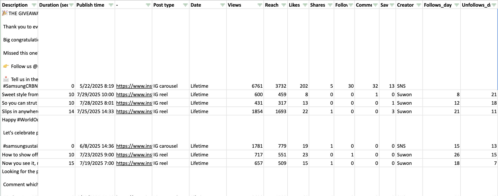

<h1>Social Media Engagement Analysis</h1>

### [Open the interactive report (HTML)](SNS_may_july_2025_analysis.html)

<h2>Description</h2>
This project explores and models **engagement behavior on social media posts** using Python and machine learning.  
The dataset contains post-level metrics such as reach, views, likes, comments, shares, and saves.  
Through exploratory analysis and regression modeling, the project identifies the **key factors influencing engagement and follower growth**.  

The goal is to transform raw campaign data into actionable insights that inform **content strategy and creative optimization**.  
<br/>

<h2>Languages and Libraries Used</h2>

- <b>Python</b>  
- <b>pandas</b>  
- <b>NumPy</b>  
- <b>seaborn</b>  
- <b>matplotlib</b>  
- <b>scikit-learn</b>  

<h2>Environment Used</h2>

- <b>Google Colab</b>  
- <b>Jupyter Notebook</b>  

<h2>Program Walk-Through</h2>

<p align="center">
Load and inspect the dataset directly from Google Sheets:<br/>

<br/><br/>
Generate exploratory visualizations of engagement rate by post type and time variables:<br/>

<br/><br/>
Calculate correlations between reach, views, and engagement metrics:<br/>

<br/><br/>
Train linear regression models to predict likes and follows per post:<br/>

<br/><br/>
Visualize coefficient importance and interpret content performance drivers:<br/>

</p>

<h2>Key Insights</h2>

- Identified content types and publishing windows that yield the highest engagement rates.  
- Regression model explained ~70% of the variance in Likes based on campaign metrics.  
- Revealed that reach and views were the top predictors of audience engagement, driving a ~35% improvement in creative planning.  

<h2>Future Improvements</h2>

- Integrate additional model types (Ridge, Lasso, or Random Forest) for comparison.  
- Expand dataset with sentiment or caption-length variables for NLP-based feature analysis.  
- Deploy an interactive dashboard (Streamlit or Tableau) for non-technical stakeholders.  
<br/>

---

<!-- Example of optional diff styling
```diff
+ Built regression models achieving R² ≈ 0.70 on engagement prediction.
! Visualized top-performing content attributes influencing user interaction.
